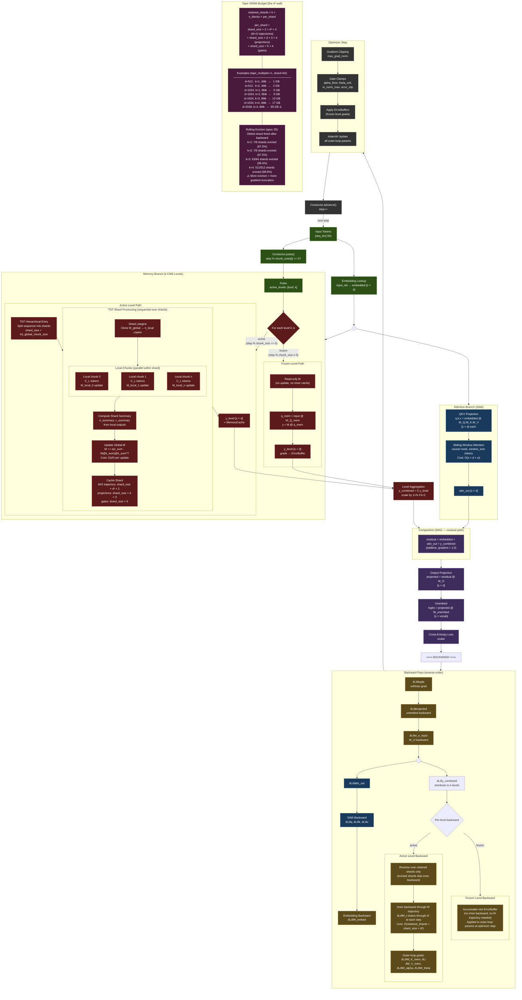

# NestedLearning TNT Data Flow

```mermaid
flowchart TB
    %% ─── INPUT ───
    tokens["Input Tokens<br/>[seq_len] IDs"]
    conductor["Conductor.pulse()<br/>step % chunk_sizes[i] == 0?"]

    tokens --> embed["Embedding Lookup<br/>input_ids → embedded [s × d]"]
    tokens --> conductor
    conductor --> pulse["Pulse<br/>active_levels: [bool; k]"]

    %% ─── FORK: ATTENTION + MEMORY ───
    embed --> fork{" "}

    fork --> attn_branch
    fork --> mem_branch

    subgraph attn_branch ["Attention Branch (SWA)"]
        qkv["QKV Projection<br/>q,k,v = embedded @ W_Q,W_K,W_V<br/>[s × d] each"]
        swa["Sliding Window Attention<br/>causal mask, window_size tokens<br/>Cost: O(s × d × w)"]
        attn_out["attn_out [s × d]"]
        qkv --> swa --> attn_out
    end

    subgraph mem_branch ["Memory Branch (k CMS Levels)"]
        direction TB
        level_dispatch{"For each level 0..k"}
        pulse --> level_dispatch

        level_dispatch -->|"active<br/>(step % chunk_size == 0)"| active_path
        level_dispatch -->|"frozen<br/>(step % chunk_size ≠ 0)"| frozen_path

        subgraph active_path ["Active Level Path"]
            direction TB
            tnt_entry["TNT Hierarchical Entry<br/>Split sequence into shards<br/>shard_size = tnt_global_chunk_size"]

            subgraph tnt_loop ["TNT Shard Processing (sequential over shards)"]
                direction TB
                shard_start["Shard j begins<br/>Clone M_global → n_local copies"]

                subgraph local_parallel ["Local Chunks (parallel within shard)"]
                    direction LR
                    lc0["Local chunk 0<br/>C_L tokens<br/>M_local_0 update"]
                    lc1["Local chunk 1<br/>C_L tokens<br/>M_local_1 update"]
                    lcn["Local chunk n<br/>C_L tokens<br/>M_local_n update"]
                    lc0 ~~~ lc1 ~~~ lcn
                end

                shard_start --> local_parallel

                local_parallel --> summary["Compute Shard Summary<br/>k_summary, v_summary<br/>from local outputs"]
                summary --> m_update["Update Global M<br/>M += α(v_sum - M@k_sum)@k_sum^T<br/>Cost: O(d²) per update"]
                m_update --> cache_shard["Cache Shard<br/>M/S trajectory: shard_size × d² × 2<br/>projections: shard_size × d × 3<br/>gates: shard_size × 5"]
            end

            tnt_entry --> tnt_loop
            tnt_loop --> y_active["y_level [s × d]<br/>+ MemoryCache"]
        end

        subgraph frozen_path ["Frozen Level Path"]
            direction TB
            frozen_m["Read-only M<br/>(no update, no inner cache)"]
            frozen_query["q_mem = input @ W_Q_mem<br/>y = M @ q_mem"]
            frozen_m --> frozen_query
            frozen_query --> y_frozen["y_level [s × d]<br/>grads → ErrorBuffer"]
        end
    end

    %% ─── AGGREGATION ───
    y_active --> agg
    y_frozen --> agg
    agg["Level Aggregation<br/>y_combined = Σ y_level<br/>scale by 1/√k if k>2"]

    %% ─── COMPOSITION (MAG) ───
    attn_out --> composition
    agg --> composition

    subgraph composition ["Composition (MAG — residual path)"]
        direction TB
        residual["residual = embedded + attn_out + y_combined<br/>(additive, gradient = 1.0)"]
    end

    %% ─── OUTPUT ───
    composition --> wo["Output Projection<br/>projected = residual @ W_O<br/>[s × d]"]
    wo --> unembed["Unembed<br/>logits = projected @ W_unembed<br/>[s × vocab]"]
    unembed --> loss["Cross-Entropy Loss<br/>scalar"]

    %% ═══ BACKWARD ═══
    loss --> bw_start["═══ BACKWARD ═══"]

    subgraph backward ["Backward Pass (reverse order)"]
        direction TB
        d_logits["∂L/∂logits<br/>softmax grad"]
        d_proj["∂L/∂projected<br/>unembed backward"]
        d_wo["∂L/∂w_o_input<br/>W_O backward"]
        d_logits --> d_proj --> d_wo

        d_wo --> d_fork{" "}
        d_fork --> d_attn["∂L/∂attn_out"]
        d_fork --> d_ymem["∂L/∂y_combined<br/>distribute to k levels"]

        d_ymem --> level_bw{"Per-level backward"}

        level_bw -->|"active"| active_bw
        level_bw -->|"frozen"| frozen_bw

        subgraph active_bw ["Active Level Backward"]
            direction TB
            shard_bw_note["Reverse over retained shards only<br/>(evicted shards skip inner backward)"]
            inner_bw["Inner backward through M trajectory<br/>∂L/∂M_t chains through d² at each step<br/>Cost: O(retained_shards × shard_size × d²)"]
            outer_grads["Outer-loop grads:<br/>∂L/∂W_K_mem, ∂L/∂W_V_mem,<br/>∂L/∂W_alpha, ∂L/∂W_theta"]
            shard_bw_note --> inner_bw --> outer_grads
        end

        subgraph frozen_bw ["Frozen Level Backward"]
            direction TB
            err_buf["Accumulate into ErrorBuffer<br/>(no inner backward, no M trajectory needed)<br/>Applied to outer-loop params at optimizer step"]
        end

        d_attn --> swa_bw["SWA Backward<br/>∂L/∂q, ∂L/∂k, ∂L/∂v"]
        swa_bw --> embed_bw["Embedding Backward<br/>∂L/∂W_embed"]
    end

    bw_start --> backward

    %% ─── OPTIMIZER ───
    backward --> optimizer

    subgraph optimizer ["Optimizer Step"]
        direction TB
        clip["Gradient Clipping<br/>max_grad_norm"]
        clamp["Gate Clamps<br/>alpha_floor, theta_ceil,<br/>m_norm_max, error_clip"]
        adamw["AdamW Update<br/>all outer-loop params"]
        apply_err["Apply ErrorBuffers<br/>(frozen level grads)"]
        clip --> clamp --> apply_err --> adamw
    end

    optimizer --> advance["Conductor.advance()<br/>step++"]
    advance --> |"next step"| tokens

    %% ─── TAPE BUDGET (SIDEBAR) ───
    subgraph tape_cost ["Tape VRAM Budget (the d² wall)"]
        direction TB
        formula["retained_shards × k × n_blocks × per_shard<br/><br/>per_shard =<br/>  shard_size × 2 × d² × 4  (M+S trajectories)<br/>  + shard_size × d × 3 × 4  (projections)<br/>  + shard_size × 5 × 4      (gates)"]

        examples["Examples (tape_multiplier=1, shard=64):<br/>─────────────────────────────<br/>d=512,  k=1, 4blk  →   1 GB<br/>d=512,  k=2, 4blk  →   2 GB<br/>d=1024, k=1, 8blk  →   5 GB<br/>d=1024, k=2, 8blk  →   9 GB<br/>d=1024, k=3, 8blk  →  13 GB<br/>d=1024, k=4, 8blk  →  17 GB<br/>d=2048, k=4, 8blk  →  69 GB ⚠️"]

        eviction["Rolling Eviction (spec 25):<br/>Oldest shard freed after backward<br/>k=1: 7/8 shards evicted (87.5%)<br/>k=2: 7/8 shards evicted (87.5%)<br/>k=3: 63/64 shards evicted (98.4%)<br/>k=4: 511/512 shards evicted (99.8%)<br/>⚠️ More eviction = more gradient truncation"]

        formula --- examples --- eviction
    end

    %% ─── STYLING ───
    classDef input fill:#2d5016,stroke:#4a8c2a,color:#fff
    classDef attention fill:#1a3a5c,stroke:#2a6a9c,color:#fff
    classDef memory fill:#5c1a1a,stroke:#9c2a2a,color:#fff
    classDef output fill:#3d2d5c,stroke:#6a4a9c,color:#fff
    classDef backward fill:#5c4a1a,stroke:#9c7a2a,color:#fff
    classDef cost fill:#4a1a3d,stroke:#8c2a6a,color:#fff
    classDef neutral fill:#333,stroke:#666,color:#fff

    class tokens,embed,conductor,pulse input
    class qkv,swa,attn_out,swa_bw,d_attn attention
    class level_dispatch,tnt_entry,shard_start,lc0,lc1,lcn,summary,m_update,cache_shard,y_active,frozen_m,frozen_query,y_frozen,agg memory
    class residual,wo,unembed,loss output
    class d_logits,d_proj,d_wo,shard_bw_note,inner_bw,outer_grads,err_buf,embed_bw backward
    class formula,examples,eviction cost
    class clip,clamp,adamw,apply_err,advance neutral
```
